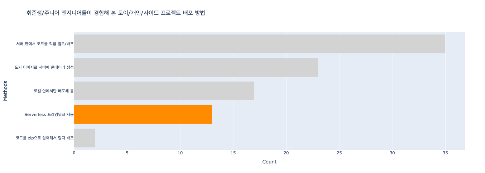

### 로컬 안에서만 배포해 봄
- 다른 PC의 사용자가 내 서비스를 사용할 수 없음

### 서버 안에서 코드 직접 빌드/배포
- State 가 있음.
- 서버가 갑자기 삭제되면? 복구하는 데 걸리는 시간은?
- Docker image 등으로 언제든 다시 똑같은 상태의 서버가 생성되는 게 이상적.

### 도커 이미지로 서버에 컨테이너 생성
- 계속 동작하는 서버가 필요한 경우엔 이상적
- EC2의 경우엔 리소스를 다 사용하지 못할 수도
- 요청이 하루에 1번 온다면?
- AWS `t4g.small` 인스턴스 기준으로 1달 서버 비용 $14.9

### 코드를 zip으로 압축해서 AWS Lambda 배포
- serverless지만, AWS Console에서 클릭을 몇 번씩 수동으로 해줘야 함. (aws cli로 할 수도 있습니다.)
- 매번 zip 파일을 만들어 일일이 올리는 것이 번거로울 수 있음
- AWS `Lambda` 기준으로 하루 1번의 요청이 올 경우 월 비용 $0 (프리 티어로 월 100만 건의 요청 무료)

### Serverless 프레임워크 사용
- [README.md](../README.md) 문서 참조.
- 응답자의 약 18%가 경험 -> 82%는 사용해보지 않음