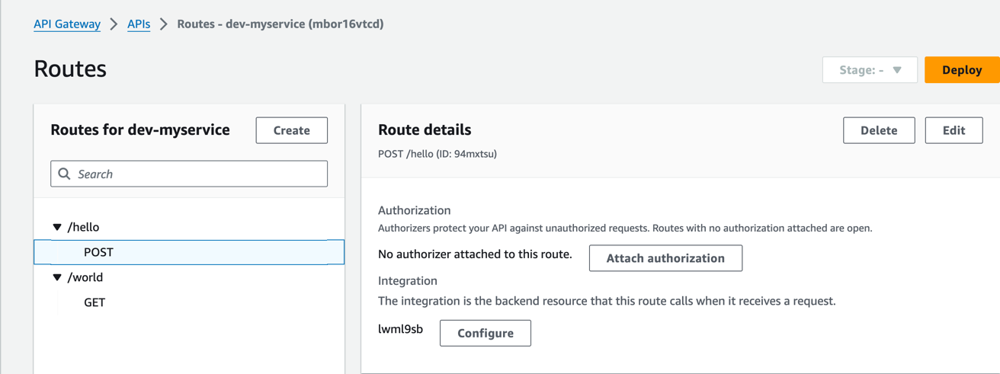
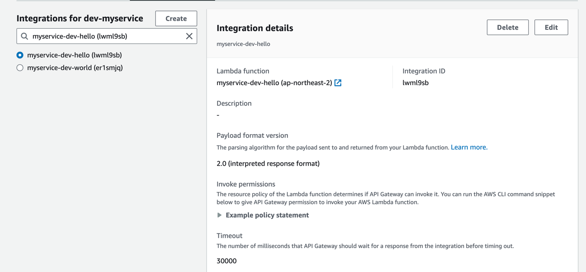
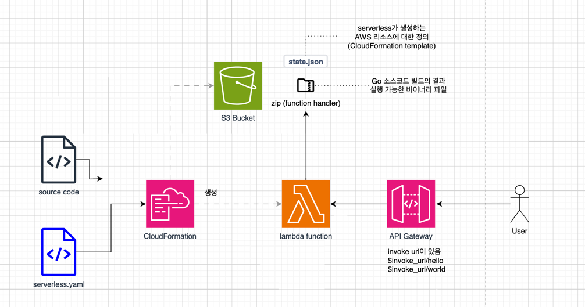

```
Deploying myservice to stage dev (ap-northeast-2)

⠧ Creating CloudFormation stack (7s)
```
- sls deploy하면 무슨 일이 생기는지
- Event 57개, 리소스 13개가 생김
- 이 함수의 전용 S3 Bucket과 policy를 만들음
- log group
- lambda function, permission(API Gateway -> lambda invoke), iam role, 
- API Gateway (얘가 뭐 하는 앤지 추가) HttpApi, HttpApiRoutePostHello
- 타임아웃 전엔 30초를 기다림





// artifact 는 뭐고 package 는 뭐냐..
package
artifact - 저장된 코드 . 그런데 컴파일된 코드?